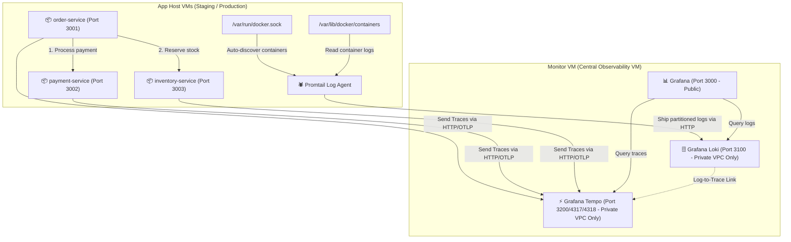

# Self-Hosted LGTM Observability Stack for NestJS Microservices

A 100% open-source, self-hosted centralized logging, tracing, and monitoring platform designed for high security and performance on DigitalOcean droplets. This stack utilizes the **LGTM Stack** (Loki, Grafana, Tempo) and **Promtail** along with **OpenTelemetry** to instrument and monitor multiple independent NestJS services with automated CI/CD deployments.

---

## 1. System Architecture



---

## 2. Directory Structure

```text
/node-observability-with-lgtm
├── .github/
│   └── workflows/
│       ├── deploy-monitor.yml     # CD for central monitor VM (Loki, Grafana, Tempo)
│       ├── deploy-staging.yml     # CD for Staging application droplets
│       └── deploy-production.yml  # CD for Production application droplets
├── infra/
│   ├── app-host/
│   │   ├── docker-compose.yml     # Promtail + Node.js application containers
│   │   └── promtail-config.yaml   # Promtail service scraper configuration
│   └── monitoring/
│       ├── docker-compose.yml     # Loki + Tempo + Grafana central container stack
│       ├── loki-config.yaml       # Multi-tenancy Loki settings
│       └── tempo-config.yaml      # OTLP trace ingestion settings
├── keys/                          # Directory for SSH Keys (gitignored)
└── services/
    ├── order-service/             # NestJS App (Service A) - CRUD and orchestrator
    ├── payment-service/           # NestJS App (Service B) - Mock payment processor
    └── inventory-service/         # NestJS App (Service C) - Mock inventory ledger
```

---

## 3. Core Concepts & Security Hardening

### 🔒 Docker / UFW Bypass Protection
By default, Docker manipulates `iptables` and bypasses local `ufw` firewalls, exposing container ports to the public internet. To prevent unauthorized telemetry endpoints from exposure:
*   We explicitly bind Loki (`3100`) and Tempo (`3200`, `4317`, `4318`) **ONLY** to the Private VPC IP of the monitor droplet (`MONITORING_VM_PRIVATE_IP`) in the `docker-compose.yml` file.
*   Only **Grafana (Port 3000)** is exposed on `0.0.0.0` for public web traffic.

### 🏢 Physical Multi-Tenancy (Loki)
Loki runs with `auth_enabled: true`. 
*   **Promtail** dynamically captures log streams and injects the `X-Scope-OrgID` HTTP header using the environment variable `${ENV_NAME}` (populated as `staging` or `production`).
*   This partitions logs at the physical storage level in Loki, keeping staging and production metrics completely isolated.

### 🔗 Distributed Tracing & Correlation
*   **OpenTelemetry Node SDK** auto-instruments all services and sends JSON-formatted console logs.
*   **Pino** is registered as the global NestJS logger. OpenTelemetry intercepts Pino calls and automatically injects active `trace_id` and `span_id` key-value pairs into standard stdout.
*   In Grafana, we use **Derived Fields** to map `"trace_id"` in Loki logs directly into a clickable hyperlink that launches the exact trace span in **Tempo**.

---

## 4. Setup & Deployment Guide

### Step 1: Clone and Configure Environment Files
Create local `.env` files in the directories where compose files sit (they are excluded from Git by `.gitignore`).

#### Monitor Droplet Configuration (`/infra/monitoring/.env`):
```env
MONITORING_VM_PRIVATE_IP=10.128.x.x  # The droplet's DigitalOcean Private VPC IP
```

#### Application Droplets Configuration (`/infra/app-host/.env`):
```env
ENV_NAME=staging  # Or 'production'
MONITORING_VM_PRIVATE_IP=10.128.x.x  # The private VPC IP of the Central Monitor Droplet
```

### Step 2: Set Up GitHub Actions CI/CD
Deployments are automated using **GitHub Environments**. Under your GitHub repository settings, create three environments:
1.  `monitoring`
2.  `staging`
3.  `production`

Inside **each** environment, configure the following secrets:
*   `HOST_IP`: The public IP of the target droplet.
*   `SSH_USER`: The SSH login username (e.g. `root`).
*   `SSH_PRIVATE_KEY`: The raw private SSH key to connect to the droplet.
*   `SSH_PASSPHRASE`: The passphrase to decrypt the SSH key (if encrypted).
*   `MONITORING_VM_PRIVATE_IP`: The private VPC IP of the monitor droplet.

Pushing to `staging` redeploys the staging environment. Pushing to `main` redeploys the monitor stack, and pushing to `production` deploys the production droplet.

---

## 5. End-to-End Verification

To test that logs and traces propagate across services:

1.  **Place a Mock Order:**
    Send a POST request to the `order-service` API:
    ```bash
    curl -X POST http://<staging-app-vm-public-ip>:3001/orders \
      -H "Content-Type: application/json" \
      -d '{"itemId": "item-1", "quantity": 2, "price": 150}'
    ```
    *Expected output:* `201 Created` with a status of `CONFIRMED`.

2.  **Verify Service Interaction:**
    Behind the scenes:
    *   `order-service` calls `payment-service` at `http://payment-service:3000/payments` to charge $300.
    *   `order-service` calls `inventory-service` at `http://inventory-service:3000/inventory/reserve` to reserve 2 items.

3.  **Inspect Grafana:**
    *   Log into Grafana (`http://<monitor-public-ip>:3000`).
    *   Query Loki for order service logs: `{app="order-service"}`.
    *   Expand any log line (like `Initiating payment validation...`). Click on the `trace_id` link.
    *   Grafana will open the Tempo trace viewer showing the exact waterfall span of the requests as they traveled from `order-service` $\rightarrow$ `payment-service` and `order-service` $\rightarrow$ `inventory-service`!
