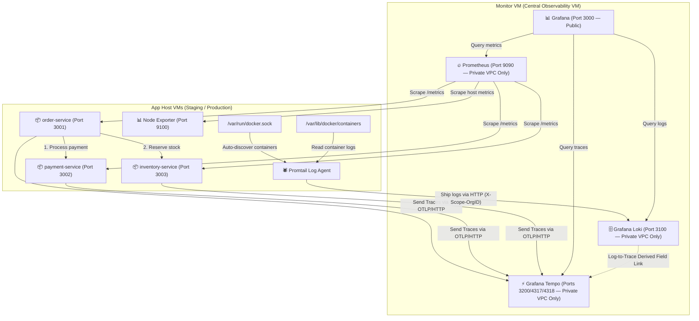

# Self-Hosted LGTM + Prometheus Observability Stack for NestJS Microservices

A 100% open-source, self-hosted centralized observability platform designed for high security and performance on **DigitalOcean droplets**. This stack provides **logs, traces, and metrics** across multiple independent NestJS microservices, with automated CI/CD deployments via GitHub Actions.

The observability stack combines:
- **Loki** — Distributed log aggregation with multi-tenancy
- **Grafana** — Unified visualization dashboard
- **Tempo** — Distributed trace storage and querying
- **Prometheus** — Time-series metrics collection
- **Promtail** — Docker-native log shipping agent
- **OpenTelemetry** — Auto-instrumented distributed tracing

---

## Table of Contents

1. [System Architecture](#1-system-architecture)
2. [Directory Structure](#2-directory-structure)
3. [NestJS Services](#3-nestjs-services)
4. [Observability Stack — How It Works](#4-observability-stack--how-it-works)
5. [Infrastructure Configuration](#5-infrastructure-configuration)
6. [Security Hardening & Core Concepts](#6-security-hardening--core-concepts)
7. [CI/CD Pipeline](#7-cicd-pipeline)
8. [Setup & Deployment Guide](#8-setup--deployment-guide)
9. [End-to-End Verification](#9-end-to-end-verification)
10. [Tech Stack Reference](#10-tech-stack-reference)

---

## 1. System Architecture

The project is split across **two types of VMs** on DigitalOcean:

- **App Host VM(s)** — Runs the NestJS application services + Promtail log agent + Node Exporter for host metrics
- **Monitor VM** — Runs the central observability stack: Loki, Tempo, Grafana, and Prometheus

All inter-VM communication uses DigitalOcean's **Private VPC network**, keeping telemetry endpoints off the public internet.



---

## 2. Directory Structure

```text
/node-observability-with-lgtm
├── .github/
│   └── workflows/
│       ├── deploy-monitor.yml      # CD: Central Monitor VM (Loki, Tempo, Grafana, Prometheus)
│       ├── deploy-staging.yml      # CD: Staging App VM (NestJS services + Promtail)
│       └── deploy-production.yml   # CD: Production App VM
├── infra/
│   ├── app-host/
│   │   ├── docker-compose.yml      # order-service, payment-service, inventory-service, Promtail, Node Exporter
│   │   ├── promtail-config.yaml    # Docker socket scraper + Loki push config
│   │   ├── .env                    # Local env (gitignored): ENV_NAME, MONITORING_VM_PRIVATE_IP
│   │   └── .env.sample             # Sample env template
│   └── monitoring/
│       ├── docker-compose.yml      # Loki, Tempo, Grafana, Prometheus container stack
│       ├── loki-config.yaml        # Multi-tenancy + TSDB schema config
│       ├── tempo-config.yaml       # OTLP gRPC + HTTP receiver config
│       ├── prometheus.yml          # Scrape config with file-based service discovery
│       ├── targets/                # Auto-generated by CI: JSON target files for Prometheus
│       ├── .env                    # Local env (gitignored): MONITORING_VM_PRIVATE_IP
│       └── .env.sample             # Sample env template
├── keys/                           # SSH keys directory (gitignored)
└── services/
    ├── order-service/              # NestJS App — Order orchestrator (CRUD + inter-service calls)
    │   ├── src/
    │   │   ├── config/
    │   │   │   └── instrumentation.ts   # OpenTelemetry SDK bootstrap (OTLP HTTP exporter)
    │   │   ├── controllers/
    │   │   │   └── order.controller.ts  # REST endpoints for orders
    │   │   ├── services/
    │   │   │   └── order.service.ts     # Business logic: calls payment + inventory services
    │   │   ├── repositories/
    │   │   │   └── order.repository.ts  # In-memory order store
    │   │   ├── dto/
    │   │   │   └── create-order.dto.ts  # Request validation DTO
    │   │   ├── app.module.ts            # NestJS module: Pino logger + Prometheus metrics
    │   │   └── main.ts                  # App bootstrap with Pino as global logger
    │   └── Dockerfile                   # Multi-stage build; injects instrumentation via --require
    ├── payment-service/            # NestJS App — Mock payment processor
    └── inventory-service/          # NestJS App — Mock inventory ledger
```

---

## 3. NestJS Services

All three services share the same structure, patterns, and observability setup. They are independent NestJS applications, each running on port `3000` internally (mapped to different host ports via Docker Compose).

### Service Overview

| Service | Host Port | Internal Role |
|---|---|---|
| `order-service` | `3001` | Orchestrator. Accepts order requests, calls `payment-service` and `inventory-service`. |
| `payment-service` | `3002` | Mock payment processor. Validates and authorizes payments. |
| `inventory-service` | `3003` | Mock inventory ledger. Reserves stock for confirmed orders. |

### Key Dependencies

```json
"@opentelemetry/sdk-node": "^0.220.0",
"@opentelemetry/exporter-trace-otlp-http": "^0.220.0",
"@opentelemetry/auto-instrumentations-node": "^0.78.0",
"@opentelemetry/api": "^1.9.1",
"nestjs-pino": "^4.6.1",
"pino": "^10.3.1",
"pino-http": "^11.0.0",
"@willsoto/nestjs-prometheus": "^6.1.0",
"prom-client": "^15.1.3"
```

### OpenTelemetry Instrumentation (`src/config/instrumentation.ts`)

Each service bootstraps the **OpenTelemetry Node SDK** before the NestJS app starts. This is the critical pattern that enables auto-instrumentation.

```typescript
import { NodeSDK } from '@opentelemetry/sdk-node';
import { OTLPTraceExporter } from '@opentelemetry/exporter-trace-otlp-http';
import { getNodeAutoInstrumentations } from '@opentelemetry/auto-instrumentations-node';

// Reads OTEL_EXPORTER_OTLP_ENDPOINT from environment (set by Docker Compose)
const traceExporter = new OTLPTraceExporter();

export const sdk = new NodeSDK({
  traceExporter,
  instrumentations: [
    getNodeAutoInstrumentations({
      // Disabled to avoid excessive noise from filesystem operations
      '@opentelemetry/instrumentation-fs': { enabled: false },
    }),
  ],
});

sdk.start();

process.on('SIGTERM', () => {
  sdk.shutdown().finally(() => process.exit(0));
});
```

> **Why `--require` in Dockerfile?** The OpenTelemetry SDK must be loaded **before** any application code runs so it can monkey-patch Node.js core modules (http, dns, etc.) for automatic instrumentation.
>
> ```dockerfile
> CMD ["node", "--require", "./dist/config/instrumentation.js", "dist/main.js"]
> ```

### Logging Setup (`src/app.module.ts`)

`nestjs-pino` is used as the global logger. OpenTelemetry automatically injects the active `trace_id` and `span_id` into every Pino log entry, enabling log-to-trace correlation in Grafana.

```typescript
LoggerModule.forRoot({
  pinoHttp: {
    level: process.env.NODE_ENV !== 'production' ? 'debug' : 'info',
    formatters: {
      level: (label) => ({ level: label }),
    },
  },
}),
PrometheusModule.register(), // Exposes /metrics endpoint for Prometheus scraping
```

### Order Orchestration Flow (`order.service.ts`)

When `POST /orders` is called, the `order-service` runs the following distributed workflow:

```
1. Create order record with status: PENDING
2. POST /payments → payment-service  (charge total amount)
3. POST /inventory/reserve → inventory-service  (reserve stock)
4. Update order status: CONFIRMED
   (on any error → status: FAILED)
```

Each step emits structured log entries via Pino that include the active `trace_id`, allowing the full distributed trace to be linked from a single log line in Grafana.

### Dockerfile (Multi-Stage Build)

```dockerfile
# Stage 1: Build
FROM node:20-alpine AS builder
WORKDIR /app
COPY package*.json ./
RUN npm install
COPY . .
RUN npm run build

# Stage 2: Production
FROM node:20-alpine
WORKDIR /app
COPY package*.json ./
RUN npm install --omit=dev
COPY --from=builder /app/dist ./dist
EXPOSE 3000
CMD ["node", "--require", "./dist/config/instrumentation.js", "dist/main.js"]
```

---

## 4. Observability Stack — How It Works

### 4.1 Distributed Tracing (OpenTelemetry → Tempo)

1. Each NestJS service loads the **OpenTelemetry SDK** at startup via `--require`.
2. Auto-instrumentation patches HTTP client calls, so when `order-service` calls `payment-service`, the `traceparent` W3C header is automatically propagated.
3. Spans are exported via **OTLP over HTTP** to Tempo at `http://<MONITORING_VM_PRIVATE_IP>:4318`.
4. The environment variable `OTEL_RESOURCE_ATTRIBUTES=deployment.environment=staging` tags all traces with the deployment environment.

### 4.2 Log Aggregation (Pino → Docker logs → Promtail → Loki)

1. NestJS services output **structured JSON logs** via Pino to `stdout`.
2. Docker captures stdout/stderr from all containers into `/var/lib/docker/containers/`.
3. **Promtail** mounts `/var/run/docker.sock` to auto-discover containers via the Docker SD API and `/var/lib/docker/containers` to read log files.
4. Promtail ships logs to Loki at `http://<MONITORING_VM_PRIVATE_IP>:3100/loki/api/v1/push` with the tenant header `X-Scope-OrgID: staging` (or `production`).
5. Logs are queryable in Grafana via LogQL: `{app="order-service"}`.

### 4.3 Metrics (Prometheus + Node Exporter)

1. Each service exposes a `/metrics` endpoint via `@willsoto/nestjs-prometheus` (`prom-client`).
2. **Node Exporter** runs on each App Host VM and exposes host-level metrics (CPU, memory, disk, network) on port `9100`.
3. **Prometheus** scrapes all targets using **file-based service discovery** (`file_sd_configs`). The target JSON files (`targets/`) are dynamically written to the Monitor VM by the `deploy-monitor.yml` CI workflow using GitHub Secrets.

```yaml
# prometheus.yml — scrape config
scrape_configs:
  - job_name: 'nestjs-services'
    metrics_path: '/metrics'
    file_sd_configs:
      - files: ['/etc/prometheus/targets/nestjs-targets.json']

  - job_name: 'node-exporter'
    file_sd_configs:
      - files: ['/etc/prometheus/targets/node-exporter-targets.json']
```

### 4.4 Log-to-Trace Correlation in Grafana

A **Derived Field** is configured in the Loki datasource in Grafana:
- **Field name:** `trace_id`
- **Regex:** `"trace_id":"(\w+)"`
- **URL template:** links to Tempo datasource via `${__value.raw}`

This makes every `trace_id` in a Loki log line a **clickable link** that opens the corresponding waterfall trace in Tempo.

---

## 5. Infrastructure Configuration

### Monitor VM — `infra/monitoring/`

#### `docker-compose.yml`

| Service | Image | Exposed Ports | Notes |
|---|---|---|---|
| `loki` | `grafana/loki:latest` | `${MONITORING_VM_PRIVATE_IP}:3100` | Bound to **private VPC only** |
| `tempo` | `grafana/tempo:latest` | `${MONITORING_VM_PRIVATE_IP}:3200`, `4317`, `4318` | Bound to **private VPC only** |
| `grafana` | `grafana/grafana:latest` | `0.0.0.0:3000` | **Public-facing** UI |
| `prometheus` | `prom/prometheus:latest` | `${MONITORING_VM_PRIVATE_IP}:9090` | Bound to **private VPC only** |

#### `loki-config.yaml` — Key Settings

```yaml
auth_enabled: true          # Enables multi-tenancy via X-Scope-OrgID header
server:
  http_listen_port: 3100
schema_config:
  configs:
    - from: 2024-01-01
      store: tsdb           # TSDB index for performance
      schema: v13
      object_store: filesystem
limits_config:
  reject_old_samples_max_age: 168h   # Reject logs older than 7 days
```

#### `tempo-config.yaml` — Key Settings

```yaml
distributor:
  receivers:
    otlp:
      protocols:
        grpc:
          endpoint: 0.0.0.0:4317
        http:
          endpoint: 0.0.0.0:4318
storage:
  trace:
    backend: local
    local:
      path: /var/tempo/blocks
    wal:
      path: /var/tempo/wal
```

---

### App Host VM — `infra/app-host/`

#### `docker-compose.yml`

| Service | Image / Build | Host Port | Key Env Vars |
|---|---|---|---|
| `promtail` | `grafana/promtail:latest` | — | `MONITORING_VM_PRIVATE_IP`, `ENV_NAME` |
| `order-service` | `./services/order-service` | `3001:3000` | `OTEL_EXPORTER_OTLP_ENDPOINT`, `OTEL_SERVICE_NAME`, `OTEL_RESOURCE_ATTRIBUTES` |
| `payment-service` | `./services/payment-service` | `3002:3000` | Same OTEL vars |
| `inventory-service` | `./services/inventory-service` | `3003:3000` | Same OTEL vars |
| `node-exporter` | `prom/node-exporter:latest` | `9100:9100` | Mounts `/proc`, `/sys`, `/` read-only |

#### `promtail-config.yaml` — Key Settings

```yaml
clients:
  - url: http://${MONITORING_VM_PRIVATE_IP}:3100/loki/api/v1/push
    tenant_id: ${ENV_NAME}   # Sets X-Scope-OrgID: staging | production

scrape_configs:
  - job_name: docker
    docker_sd_configs:
      - host: unix:///var/run/docker.sock
        refresh_interval: 5s
    relabel_configs:
      # Extracts container name and applies it as the 'app' label in Loki
      - source_labels: [__meta_docker_container_name]
        regex: '/(.*)'
        target_label: 'app'
```

---

## 6. Security Hardening & Core Concepts

### 🔒 Docker / UFW Bypass Protection

By default, Docker manipulates `iptables` and bypasses `ufw`, exposing container ports to the public internet. To prevent unauthorized access to telemetry endpoints:

- Loki (`3100`), Tempo (`3200`, `4317`, `4318`), and Prometheus (`9090`) are bound **exclusively** to `${MONITORING_VM_PRIVATE_IP}` (the droplet's DigitalOcean Private VPC IP).
- Only **Grafana** (`3000`) is bound to `0.0.0.0` for public web traffic.
- App Host services are accessible only via their mapped host ports.

### 🏢 Physical Multi-Tenancy (Loki)

Loki runs with `auth_enabled: true`, enabling Loki's multi-tenancy mode:

- Promtail dynamically sets the `tenant_id` to `${ENV_NAME}` (`staging` or `production`), which becomes the `X-Scope-OrgID` HTTP header.
- This partitions logs at the **physical storage level** inside Loki — staging and production logs are completely isolated and cannot bleed into each other.
- In Grafana, each datasource query specifies the `X-Scope-OrgID` header to target the correct tenant.

### 🔗 Distributed Tracing & Log Correlation

- **OpenTelemetry Node SDK** auto-instruments all services: HTTP clients, DNS, TCP, Node.js core modules.
- **W3C `traceparent` header propagation** is automatic — when `order-service` makes a `fetch()` call to `payment-service`, the trace context is forwarded transparently.
- **Pino + OpenTelemetry bridge**: The OTel SDK intercepts Pino log calls and injects `trace_id` and `span_id` fields into every JSON log line emitted to stdout.
- **Grafana Derived Fields** convert the `trace_id` string in a Loki log entry into a clickable hyperlink that opens the exact trace in Tempo.

### 📊 Infrastructure Metrics (Prometheus + Node Exporter)

- `prom-client` (via `@willsoto/nestjs-prometheus`) exposes a standard `/metrics` endpoint on each NestJS service, providing HTTP request counts, durations, and Node.js runtime metrics (event loop lag, heap usage, GC, etc.).
- `node-exporter` provides OS-level metrics (CPU usage, memory, disk I/O, network throughput) for each VM.
- Prometheus uses **file-based service discovery** so that target IPs (injected from GitHub Secrets during CI) do not need to be hardcoded in the config file.

---

## 7. CI/CD Pipeline

All deployments are automated using **GitHub Actions** and **GitHub Environments**. Each workflow is triggered by path filters so only relevant changes trigger a deployment.

### Workflow Overview

| Workflow | Branch | Trigger Paths | Target |
|---|---|---|---|
| `deploy-monitor.yml` | `main` | `infra/monitoring/**` | Central Monitor VM |
| `deploy-staging.yml` | `staging` | `infra/app-host/**`, `services/**` | Staging App VM |
| `deploy-production.yml` | `production` | `infra/app-host/**`, `services/**` | Production App VM |

### Deployment Process

Each workflow:
1. Connects to the target VM via **SSH** (using `appleboy/ssh-action`).
2. Clones or pulls the repository to `/app` on the VM.
3. Writes the `.env` file from GitHub Secrets directly on the VM.
4. Runs `docker compose up -d --build` (app VMs rebuild images) or `docker compose pull && docker compose up -d` (monitor VM uses pre-built images).

### Monitor VM — Additional Step: Prometheus Target Generation

The `deploy-monitor.yml` workflow dynamically **generates Prometheus target files** on the Monitor VM using GitHub Secrets. This is how Prometheus knows the private IPs of the App Host VMs without storing them in version control:

```yaml
# Written to /app/infra/monitoring/targets/nestjs-targets.json on the Monitor VM
[
  {
    "targets": ["<STAGING_PRIVATE_IP>:3001", "<STAGING_PRIVATE_IP>:3002", "<STAGING_PRIVATE_IP>:3003"],
    "labels": { "env": "staging" }
  },
  {
    "targets": ["<PROD_PRIVATE_IP>:3001", "<PROD_PRIVATE_IP>:3002", "<PROD_PRIVATE_IP>:3003"],
    "labels": { "env": "production" }
  }
]
```

---

## 8. Setup & Deployment Guide

### Prerequisites

- Two (or more) DigitalOcean Droplets on the same **Private VPC network**:
  - **Monitor VM**: Runs Loki, Tempo, Grafana, Prometheus
  - **App Host VM(s)**: Runs NestJS services, Promtail, Node Exporter
- Docker and Docker Compose installed on all VMs
- A GitHub repository with Actions enabled

### Step 1: Configure GitHub Environments & Secrets

In your GitHub repository, go to **Settings → Environments** and create three environments: `monitoring`, `staging`, `production`.

Add the following secrets to **each** environment:

| Secret | Description |
|---|---|
| `HOST_IP` | Public IP of the target droplet |
| `SSH_USER` | SSH login username (e.g. `root`) |
| `SSH_PRIVATE_KEY` | Raw private SSH key content |
| `SSH_PASSPHRASE` | Passphrase to decrypt the SSH key (if set) |
| `MONITORING_VM_PRIVATE_IP` | Private VPC IP of the Monitor VM |

Add these additional secrets to the **`monitoring`** environment only:

| Secret | Description |
|---|---|
| `STAGING_PRIVATE_IP` | Private VPC IP of the Staging App Host VM |
| `PROD_PRIVATE_IP` | Private VPC IP of the Production App Host VM |

### Step 2: Trigger Deployments

- **Deploy the Monitor Stack:** Push a change to `infra/monitoring/**` on the `main` branch.
- **Deploy Staging:** Push a change to `services/**` or `infra/app-host/**` on the `staging` branch.
- **Deploy Production:** Push a change to the `production` branch.

### Step 3: Configure Grafana

1. Navigate to `http://<MONITOR_VM_PUBLIC_IP>:3000` (default credentials: `admin`/`admin`).
2. Add data sources:
   - **Loki**: URL `http://loki:3100`, set HTTP Header `X-Scope-OrgID: staging`
   - **Tempo**: URL `http://tempo:3200`
   - **Prometheus**: URL `http://prometheus:9090`
3. In the **Loki datasource**, add a Derived Field:
   - Name: `TraceID`
   - Regex: `"trace_id":"(\w+)"`
   - Query: `${__value.raw}` (linked to Tempo datasource)

### Step 4: Local `.env` Files (for manual testing)

If running `docker compose` manually on the VMs, create `.env` files:

**Monitor VM** — `infra/monitoring/.env`:
```env
MONITORING_VM_PRIVATE_IP=10.128.x.x
```

**App Host VMs** — `infra/app-host/.env`:
```env
ENV_NAME=staging
MONITORING_VM_PRIVATE_IP=10.128.x.x
```

---

## 9. End-to-End Verification

### Place a Mock Order

```bash
curl -X POST http://<STAGING_APP_VM_PUBLIC_IP>:3001/orders \
  -H "Content-Type: application/json" \
  -d '{"itemId": "item-1", "quantity": 2, "price": 150}'
```

**Expected response:** `201 Created`
```json
{
  "id": "...",
  "itemId": "item-1",
  "quantity": 2,
  "price": 150,
  "status": "CONFIRMED"
}
```

### What Happens Behind the Scenes

```
POST /orders (order-service:3001)
  ├─→ POST /payments (payment-service:3000)        — charges 300 (150 × 2)
  └─→ POST /inventory/reserve (inventory-service:3000) — reserves 2 of item-1
```

All three HTTP hops are captured as **spans** in the same distributed trace, connected by W3C `traceparent` header propagation.

### Inspect in Grafana

1. **Loki Logs:** Query `{app="order-service"}` — see structured JSON logs with `trace_id` field.
2. **Tempo Trace:** Click any `trace_id` derived field link — opens the waterfall trace showing all spans across all three services.
3. **Prometheus Metrics:** Query `http_requests_total` or `nodejs_heap_used_bytes` to observe service and system health.

### Additional API Endpoints

```bash
# Get a specific order
curl http://<APP_VM_IP>:3001/orders/<order-id>

# Get all orders
curl http://<APP_VM_IP>:3001/orders

# Delete an order
curl -X DELETE http://<APP_VM_IP>:3001/orders/<order-id>

# View raw Prometheus metrics
curl http://<APP_VM_IP>:3001/metrics
```

---

## 10. Tech Stack Reference

### Application Layer

| Technology | Version | Purpose |
|---|---|---|
| Node.js | 20 (Alpine) | Runtime |
| NestJS | ^11.0.1 | Application framework |
| TypeScript | ^5.7.3 | Language |
| nestjs-pino | ^4.6.1 | Structured JSON logging |
| pino / pino-http | ^10.3.1 / ^11.0.0 | Log formatting and HTTP logging |
| @willsoto/nestjs-prometheus | ^6.1.0 | Prometheus metrics integration |
| prom-client | ^15.1.3 | Metrics client |

### OpenTelemetry

| Package | Version | Purpose |
|---|---|---|
| @opentelemetry/sdk-node | ^0.220.0 | Core SDK |
| @opentelemetry/exporter-trace-otlp-http | ^0.220.0 | OTLP HTTP trace export |
| @opentelemetry/auto-instrumentations-node | ^0.78.0 | Auto-patch http, dns, etc. |
| @opentelemetry/api | ^1.9.1 | Context propagation API |

### Observability Infrastructure

| Tool | Image | Purpose |
|---|---|---|
| Grafana Loki | `grafana/loki:latest` | Log aggregation (multi-tenant) |
| Grafana Tempo | `grafana/tempo:latest` | Distributed trace storage |
| Grafana | `grafana/grafana:latest` | Unified visualization |
| Prometheus | `prom/prometheus:latest` | Metrics collection and alerting |
| Grafana Promtail | `grafana/promtail:latest` | Docker log shipping agent |
| Prometheus Node Exporter | `prom/node-exporter:latest` | Host-level OS metrics |

### CI/CD

| Tool | Purpose |
|---|---|
| GitHub Actions | Workflow automation |
| GitHub Environments | Environment-scoped secrets |
| appleboy/ssh-action@v1.0.3 | SSH deployment to VMs |
| Docker Compose | Container orchestration on VMs |
